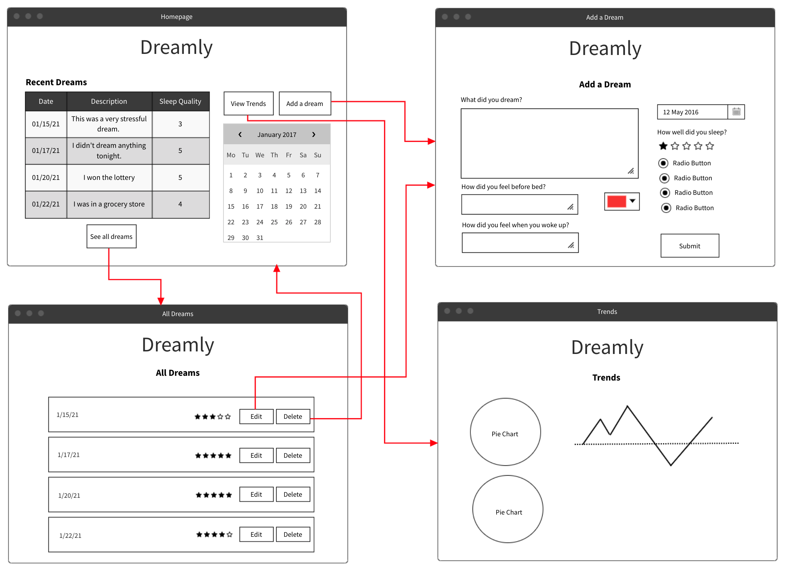

# Week 7 Assignment

## The name of your project
Dreamly (*Name may change*) Dream Journal

## Elevator Pitch
This site can be used to track your dreams, you can record your moods on going to sleep and waking up, and then view charts to see patterns and trends. I would like to also incorporate a Natural Language sentiment analysis API to automatically assess the basic feel of the dreams and hopefully provide better charts/graphs using that info.

## Wireframes

## Dependencies
* Firebase for DB and Deployment
* I found a sunrise/sunset time API that I might incorporate - https://sunrise-sunset.org/api
* react-charts package - https://www.npmjs.com/package/react-charts
* MeaningCloud API for Sentiment Analysis - https://learn.meaningcloud.com/developer/sentiment-analysis/2.1/doc/what-is-sentiment-analysis
* A React calendar package - https://www.npmjs.com/package/react-calendar

## Tasks
1. Setup create-react-app scaffold
2. Set up Firebase DB connection
3. Create homepage component, add dream component, trend component, and view all entries component
4. Set up routing
5. Work on creating the add dream form
6. [BONUS ITEM] Set up MeaningCloud API to analyze text sentiment on submit
7. Create components to show the compressed dream in both the show all page, and the recent dreams list in the homepage
8. [BONUS ITEM] Work on the chart/data trend page using react-charts
9. Set up deployment via Firebase with CI/CD through GitHub

## Plan for the next 3 weeks
1. Create scaffold, hook up Firebase, set up routing
2. Create all major components (pages, compressed dream entry), incorporate react-charts [BONUS] and deploy app via Firebase
3. Finalize styling of app/site and make any tweaks I need to data collected or displayed
